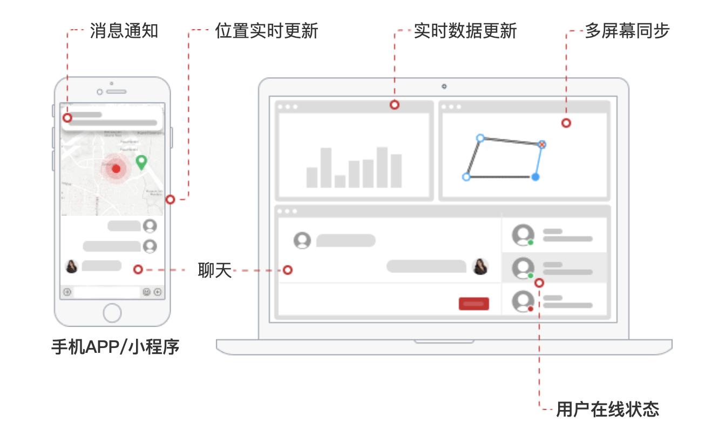

# goeasy

Build the web real-time messaging systems in lightning speed.

快速打造您的web实时通讯体系。

## 这是一个什么项目

Goeasy 是一个为您的应用提供web实时通讯能力的云服务和解决方案。

什么是“web实时通讯”？简单的说，它让服务端能够向在线的客户端发送消息。无论何时有消息，客户端都能实时的收到。

## 能用来做什么？

从服务端向客户端发送消息，从来都不是一件容易的事。这里的客户端，不仅仅是网页浏览器，还包括小程序，APP。

您的应用只需要接入 Goeasy 的 API 接口，就能简单方便的获得从服务端向客户端发送消息的能力。Goeasy 的云服务在背后为您处理所有复杂困难的事情。

## 使用场景

系统提醒、聊天、用户上下线提醒、客户端远程同步、在线多人协作、游戏、扫码登录。

## 架构简图

