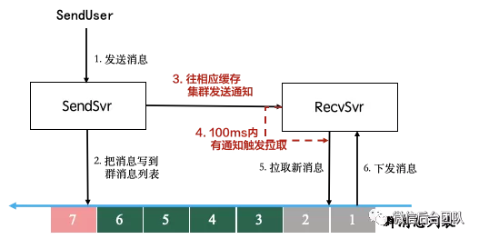

# liveroom

Liveroom 是一个“可靠的消息通道”的示例。它包含一个简单实现的聊天室服务。

## Overview 概要设计

Liveroom 是一个无状态的服务。它依赖下面这些基础组件，

* redis 里存储房间的消息列表，房间的在线列表
* nats 用来订阅和通知房间消息有更新

值得注意的一点是，一个房间的在线列表，是所有最近有收取该房间消息的用户。当用户进入聊天室的时候，我们更新这个列表；当用户收取消息的时候，同样也要更新这个列表。

用户进入聊天室之后，就开始收取消息。为了让用户实时同步到新消息，收取消息的 API 采用 long-polling 机制。用户的收取行为，也可以看作是用户的心跳。

简单起见，上图里的接入层、业务logicsvr、RecvSvr都在 Liveroom 里实现。“接入层”的处理在 Room.Recv handler，它向 redis 查询是否有新消息，这个查询请求可以重放。如果没有消息，将执行 SubscribeSync AutoUnsubscribe(1) NextMsg(time.Minute) 等待通知。上图里的 RoomX Waiting Queue 由 nats 提供。

房间的消息列表，由用户在房间里的行为所产生。这里的“消息”是一个广泛的概念，包括但不限于“进入”“退出”“发送文字”等等。

## Reference 参考

* [微信直播聊天室架构演进](https://mp.weixin.qq.com/s/poZo0uHl88n9TadBKUzFVA)
* [微信序列号生成器架构设计及演变](https://mp.weixin.qq.com/s/JqIJupVKUNuQYIDDxRtfqA)
